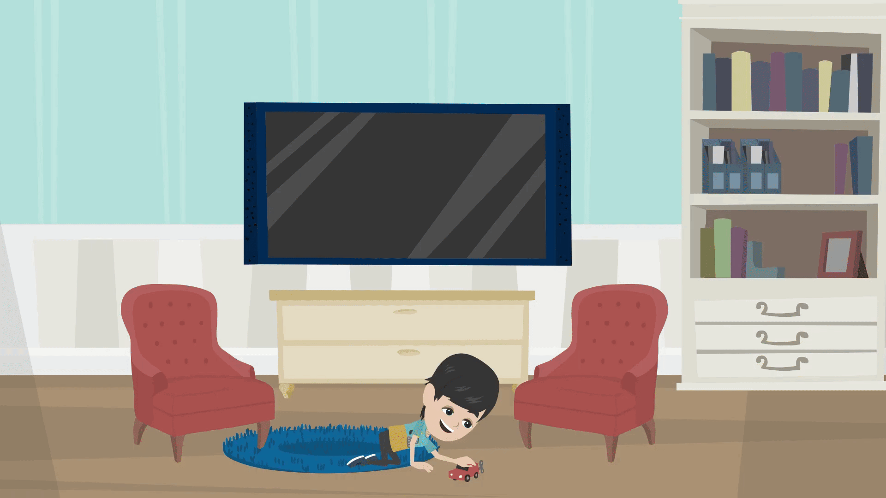
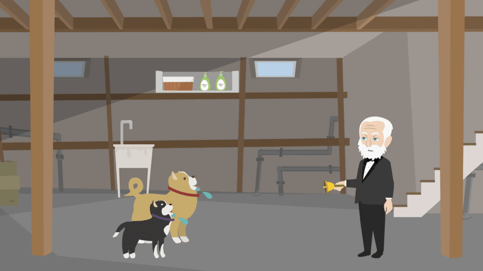

<!DOCTYPE html>
<html lang="es">
<head>
  <meta charset="UTF-8" />
  <meta name="viewport" content="width=device-width, initial-scale=1.0" />
  <title>Presentación Conductivismo - Grupo 3</title>
  
  
</head>
<body class="bg-gray-900 text-white">
  

    

      <!-- Imagen principal -->
      
      
      <!-- GIFs para slide9.png -->
      
      

      <!-- GIFs para slide10.png -->
      
      

      <!-- GIF para slide14.png -->
      
    

    

      <button id="prevBtn" class="70bg-blue-600 hover:bg-blue-700 text-white px-5 py-2 rounded-xl disabled:opacity-50">Anterior</button>
      1 / 16
      <button id="nextBtn" class="bg-blue-600 hover:bg-blue-700 text-white px-5 py-2 rounded-xl">Siguiente</button>
    

  

  
</body>
</html>
